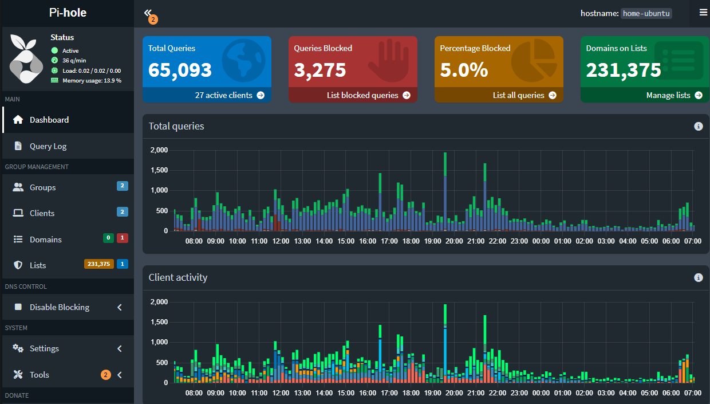

# 🧰 Pi-hole Docker Setup

This project runs [Pi-hole](https://pi-hole.net/) in a Docker container using a simple `docker-compose` configuration with `.env` support.

Pi-hole is a DNS sinkhole that protects your devices from unwanted content and ads by blocking known domains at the network level. It can also serve as a local DHCP server.

---

## 🚀 Features

- Easy deployment via Docker Compose
- Environment variable support via `.env` file
- Host networking enabled for optional DHCP support
- Persistent data storage
- Configured with customizable upstream DNS servers

---

## 📦 Getting Started

### 1. Clone this repository

```bash
git clone https://github.com/jbresaw/docker-pihole.git
cd pihole
```

### 2. Copy and configure the environment file

```bash
cp .env-example .env
```

Edit `.env` to customize timezone, DNS servers, and web password.

### 3. Create the necessary folder

```bash
mkdir -p etc-pihole
```

### 4. Start the container

```bash
docker compose up -d
```

> If you're not using Docker Compose V2, use `docker-compose up -d`.

---

## ⚙️ Configuration Notes

- **Environment Variables (defined in `.env`)**:
  - `TZ`: System timezone (e.g., `America/New_York`)
  - `PIHOLE_PASSWORD`: Web interface password
  - `DNS_SERVERS`: Comma-separated list of upstream DNS servers (e.g., `1.1.1.1,8.8.8.8`)
- **Host networking**: Required for Pi-hole’s DHCP server to work. If not using DHCP, you may switch to bridge mode and expose ports manually.
- **Persistent volume**:
  - `./etc-pihole`: Contains Pi-hole configuration, logs, and lists

---

## 🖥️ Access the Web UI

Open your browser and visit:

```
http://<your-host-ip>/admin
```

Login using the password defined under `PIHOLE_PASSWORD`.

---

## 📸 Screenshots



---

## 🧾 File Structure

```
.
├── docker-compose.yml
├── .env-example
├── .env          # <- Not committed (see .gitignore)
├── etc-pihole/   # <- Volume mount for persistent config
└── README.md
```

---

## 📌 Notes

- Tested on Linux with Docker Engine.
- Host networking may not work in all environments (e.g., certain Proxmox container setups).
- If not using DHCP, consider using bridge networking and manually exposing:
  - TCP 80: Web UI
  - UDP/TCP 53: DNS

---

## ✅ To-Do / Improvements

- Add backup/versioning script
- Include optional logging/export to Grafana or Prometheus
- Add bridge networking example

---

## 🧠 Author Notes

This setup is part of my home lab and learning journey into Docker, observability, and network tools. Check out my other projects on [GitHub](https://github.com/jbresaw)!
